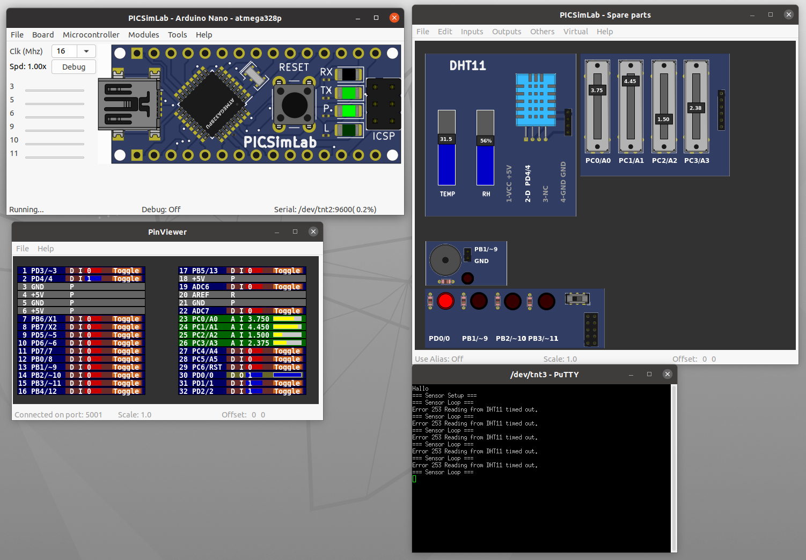

# Dew Point Alarm - Short README

This project simulates an Arduino Nano that measures and displays the dew point, with an alarm feature when certain thresholds are crossed.

## Requirements

- **picSimLab**  
  - Use the configuration file: `dew_point_alarm.pzw`  
  - This configuration simulates an Arduino Nano environment within picSimLab.
  - Setup
    - Build from source [GitHub: PICSimLab](https://github.com/lcgamboa/picsimlab)
    - `./bscripts/build_all_and_install.sh`
    - Add your account to the `dialout` group: `sudo usermod -aG dialout $USER`

- **Arduino IDE**  
  - Open the sketch located in `dew_point_alarm/dew_point_alarm.ino`.  
  - Compile and upload it (in the simulation environment or to a real Arduino Nano if desired).
  - [Arduino IDE](https://www.arduino.cc/en/software)

- **PuTTY** (or any serial terminal)  
  - Connect to `/dev/tnt3` (or the correct COM port equivalent on Windows).  
  - Set the baud rate to **9600**.
  - `apt install putty`

## Usage

1. **Load the Simulation**  
   - Launch picSimLab.  
   - Open the provided `.pzw` file (`dew_point_alarm.pzw`).  

2. **Load the Arduino Sketch**  
   - In the Arduino IDE, open `dew_point_alarm.ino`.  
   - Verify and compile the sketch [ctrl + r]
   - Export the compiled binary [ctrl + alt + s]
   - Upload the `.hex` file to the simulated board (or a real Arduino Nano).  

3. **Serial Monitoring**  
   - In PuTTY, connect to `/dev/tnt3`.  
   - Confirm the baud rate is 9600.  
   - The device will output sensor readings and trigger an alarm message when the dew point crosses the threshold.

4. **Adjusting Thresholds**  
   - Update any threshold or calibration values in the `.ino` file as needed.  
   - Re-upload the sketch to apply changes.

Feel free to customize the code or wiring based on your specific sensor setup and requirements.  